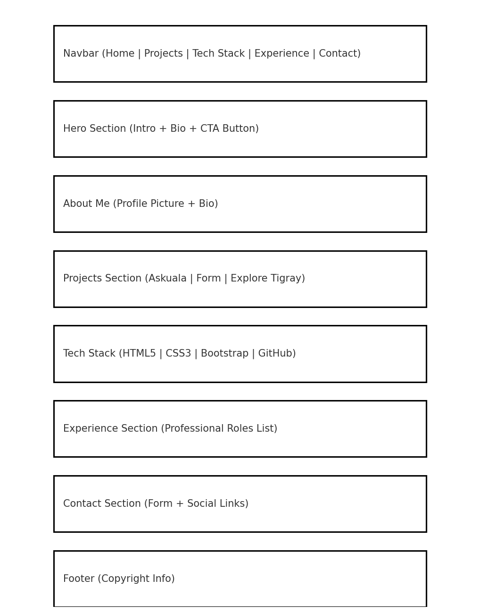
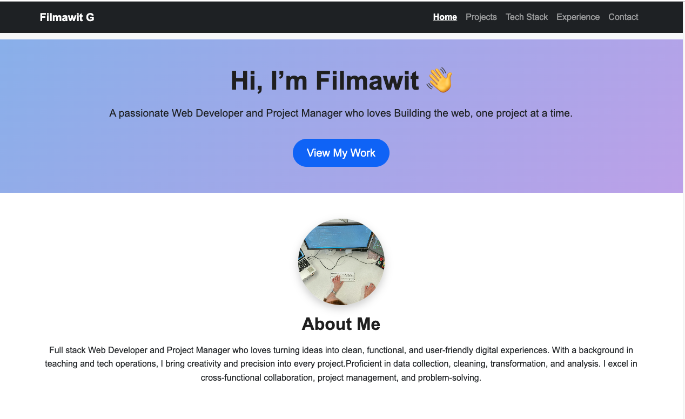
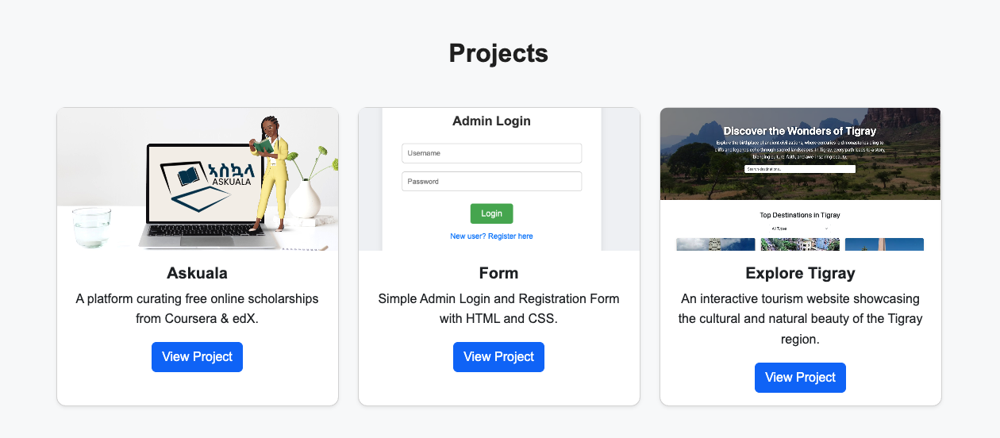
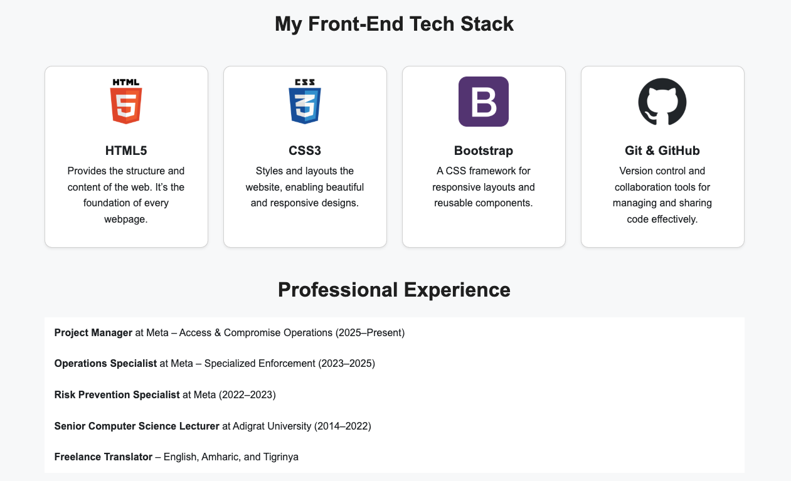
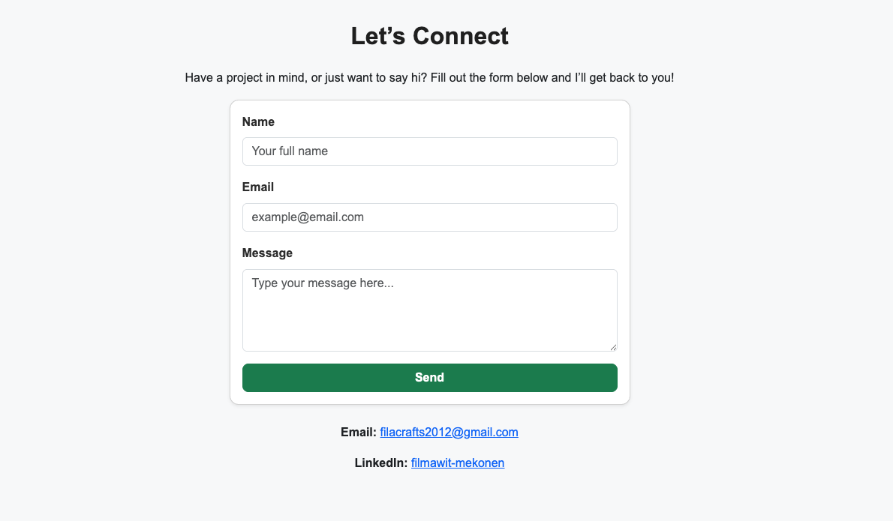

# 💻 Filmawit Portfolio – Front-End Development Project

## 📖 Project Overview

**Filmawit Portfolio** is a responsive personal website that showcases my **projects, technical skills, and professional experience**.
It is built with **HTML, CSS, and Bootstrap** to demonstrate **semantic structure, accessibility, and user-centered design principles**.

🔑 _Tagline_: _“A responsive portfolio website showcasing projects, technical skills, and experience — built with clean, modern front-end design.”_

This project was created as part of the **User-Centric Front-End Development Milestone Project**.

---

## 🎯 User Stories & Acceptance Criteria

### External User Goals

1. **View developer’s background**

   - As a visitor, I want to **see the developer’s profile and experience** so I can quickly understand their skills.
     ✅ Acceptance Criteria: About section with profile picture and biography.

2. **Explore projects**

   - As a visitor, I want to **view projects with screenshots and descriptions** so I can explore the developer’s work.
     ✅ Acceptance Criteria: Project cards with images, descriptions, and working links.

3. **Navigate easily**

   - As a visitor, I want to **navigate easily across the site** without confusion.
     ✅ Acceptance Criteria: Responsive navbar with smooth scrolling.

4. **Contact the developer**

   - As a visitor, I want to **contact the developer** through a form or social links.
     ✅ Acceptance Criteria: Contact form with validation + alternative email/LinkedIn links.

### Site Owner Goals

- Showcase **projects, skills, and experience** professionally.
- Ensure **mobile-first, responsive design** for accessibility across devices.
- Provide a **direct way for employers/collaborators to reach out**.

---

## ✨ Features

1. **Home / About Me**

   - Hero section with introduction and call-to-action.
   - Profile picture with short biography.

2. **Projects**

   - Interactive project cards with screenshots and links:

     - **Askuala** – Scholarship platform.
     - **Form** – Admin login and registration form.
     - **Explore Tigray** – Tourism website.

3. **Tech Stack**

   - Visual cards for **HTML5, CSS3, Bootstrap, Git & GitHub**.

4. **Professional Experience**

   - Clean list format showcasing work history.

5. **Contact**

   - Form with required field validation.
   - Email & LinkedIn links for alternative contact.

6. **Responsive Design**

   - Fully responsive across **desktop, tablet, and mobile**.
   - Navbar collapses into a hamburger menu on smaller screens.

---

## 🎨 Wireframes

Wireframes were designed for planning the layout before development.

- \*\*Desktop views included.



---

## 🖼️ Final Design Screenshots

| Section          | Screenshot                                                      |
| ---------------- | --------------------------------------------------------------- |
| About Me Section |           |
| Projects Page    |     |
| Tech Stack Page  |  |
| Contact Page     |       |

---

## 🛠️ Technologies Used

- **HTML5** – semantic structure.
- **CSS3** – styling and layout.
- **Bootstrap 5** – responsive grid and reusable components.
- **Git & GitHub** – version control and collaboration.
- **GitHub Pages** – hosting and deployment.

---

## ✅ Testing

Testing was carried out to ensure features, responsiveness, and accessibility worked correctly across devices and browsers.

### 1. HTML Validation

- Tool: [W3C Markup Validator](https://validator.w3.org/)
- ✅ Result: No errors.

### 2. CSS Validation

- Tool: [W3C Jigsaw Validator](https://jigsaw.w3.org/css-validator/)
- ✅ Result: No errors.

### 3. Responsiveness

- Tool: \[Chrome DevTools] & [Responsive Design Checker](https://responsivedesignchecker.com/)
- ✅ Result: Layout adapts seamlessly.

| Device           | Tested          | Result   |
| ---------------- | --------------- | -------- |
| Desktop (1920px) | Chrome, Edge    | ✅ Works |
| Tablet (768px)   | Safari, Chrome  | ✅ Works |
| Mobile (375px)   | Chrome, Firefox | ✅ Works |

### 4. Lighthouse Audit

- Tool: Chrome Lighthouse
- Results:

  - **Performance**: ✅
  - **Accessibility**: ✅
  - **Best Practices**: ✅

---

## 📝 Manual Testing

| Feature           | Test                                     | Result   |
| ----------------- | ---------------------------------------- | -------- |
| Navbar Links      | Click each → correct section scrolls     | ✅ Works |
| Project Cards     | “View Project” → opens correct page/link | ✅ Works |
| Contact Form      | Empty submission → validation error      | ✅ Works |
| Contact Form      | Valid submission → redirects to Formdump | ✅ Works |
| Responsive Layout | Resize browser → adjusts automatically   | ✅ Works |
| Accessibility     | Tested keyboard navigation + alt text    | ✅ Works |

---

## 🚀 Deployment

The project is deployed on **GitHub Pages**.

### Live Demo

🔗 [Filmawit Portfolio](https://fila2021.github.io/filmawit-portfolio/)

### Local Deployment

1. Clone the repository:

   ```bash
   git clone https://github.com/fila2021/filmawit-portfolio.git
   ```

2. Navigate into the project folder.
3. Open `index.html` in your browser.

---

## ♿ Accessibility

- ✅ All images include descriptive **alt text**.
- ✅ High **color contrast** ensures readability.
- ✅ Fully responsive for screen scaling.
- ✅ Forms include **labels** for screen readers.
- ✅ Tested with **keyboard-only navigation**.

---

## 🙌 Credits

- **Bootstrap 5** → [https://getbootstrap.com](https://getbootstrap.com)
- **Form Handling** → [Code Institute Formdump](https://formdump.codeinstitute.net/)
- **Images** → Project assets and placeholders.
- All other code authored by **Filmawit Mekonen Gebreegziabher**.

---

## 🐛 Bugs & Fixes

- **Footer floated mid-page** → Fixed with `d-flex flex-column min-vh-100`.
- **Explore Tigray project image broken** → Corrected file path.
- **Commit history too vague** → Adopted **Conventional Commits** (e.g., `add Explore Tigray card`).

---

## 🔮 Future Enhancements

- Add **JavaScript animations** for smoother interactivity.
- Expand **Projects section** with more case studies.
- Include a **downloadable CV**.
- Add **blog section** with developer updates.

---

## ✅ Open Issues

- None at this stage. All planned features validated.
