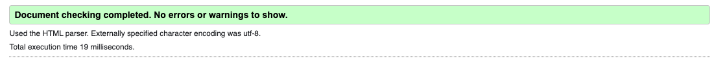
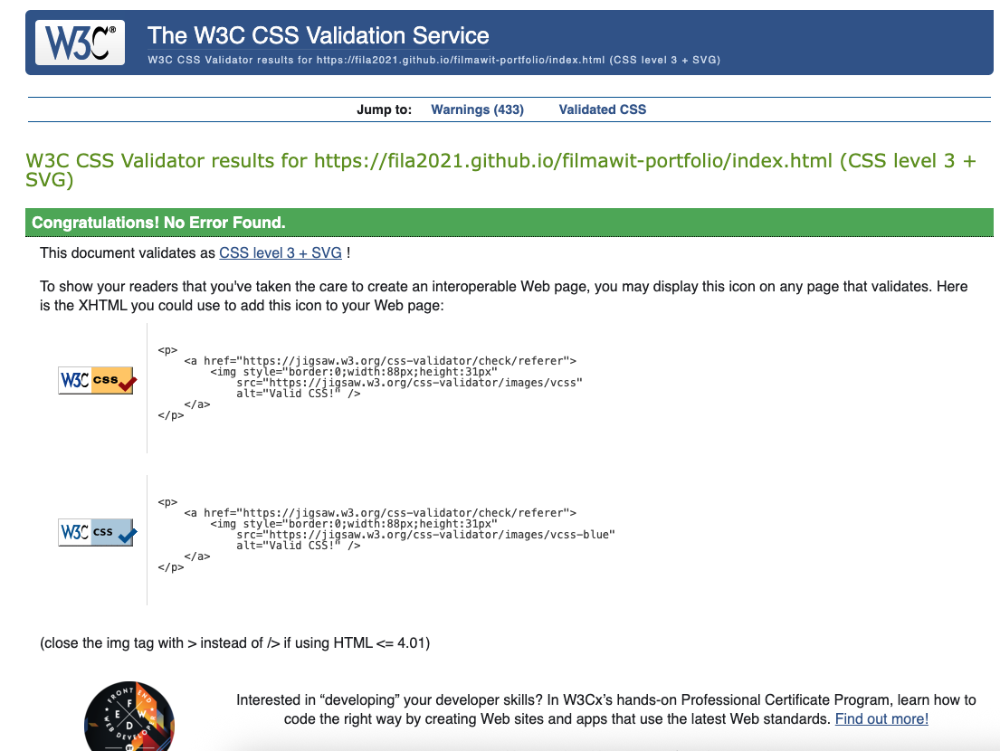

# 💻 Filmawit Portfolio – Front-End Development Project

## 📖 Project Overview

**Filmawit Portfolio** is a personal front-end website showcasing my **projects, professional experience, and technical skills**.
The site demonstrates **responsive design, accessibility, and user-centered design principles**, and includes a contact form for visitors to reach out.

This project was built as part of the **User Centric Front-End Development Milestone Project**.

---

## 🎯 User Stories

### External User Goals

- As a visitor, I want to **see the developer’s profile and experience** so I can quickly understand their background.
- As a visitor, I want to **view projects** with screenshots and descriptions so I can explore the developer’s work.
- As a visitor, I want to **navigate easily across pages** without confusion.
- As a visitor, I want to **contact the developer** through a simple form or social links.

### Site Owner Goals

- Present my **projects and skills** professionally.
- Provide an **accessible, responsive portfolio** that works on all devices.
- Allow potential employers or collaborators to **get in touch easily**.
- Showcase the use of **semantic HTML, CSS, and Bootstrap** to meet academic and industry standards.

---

## ✨ Features

### 1. Home / About Me

- Profile picture and short biography.
- Introduction to professional background and learning journey.

### 2. Projects

- **Project Cards** with images, descriptions, and links:

  - **Askuala** – a scholarship listing platform.
  - **Portfolio Website** – this site itself.
  - **Explore Tigray** – a travel website highlighting Ethiopian destinations.

- Professional Experience section in list format.

### 3. Tech Stack

- Visual cards for **HTML5, CSS3, Bootstrap, Git & GitHub**.
- Consistent styling for readability.

### 4. Contact

- **Contact form** with validation for required fields.
- Email and LinkedIn links.
- Submissions can be redirected to **Code Institute Formdump** for testing.

### 5. Askuala (Standalone Project Page)

- Dedicated landing page showcasing scholarship listings.
- Structured sections with grid layout for scholarship cards.

### 6. Responsive Design

- Mobile-first design with **Bootstrap grid system**.
- Works on **desktop, tablet, and mobile**.

---

## 🎨 Wireframes

Wireframes were created to plan the layout before development.

### Home

### Projects

### Tech Stack

### Contact

---

## 🖼️ Screenshots (Final Design)

| Page / Feature   | Screenshot                                                      |
| ---------------- | --------------------------------------------------------------- |
| About Me Section |           |
| Projects Page    |     |
| Tech Stack Page  |  |
| Contact Page     |       |

---

## 🛠️ Technologies Used

- **HTML5** – semantic structure.
- **CSS3** – styling and layout.
- **Bootstrap 5** – responsive grid and components.
- **Git & GitHub** – version control and deployment.
- **GitHub Pages** – project hosting.

---

## ✅ Testing

Testing was carried out systematically to ensure all features, links, and forms work correctly across devices and browsers.

---

### 1. HTML Validation

- Tool: [W3C Markup Validator](https://validator.w3.org/)
- Result: No errors found across all pages.
- Screenshot: 

---

### 2. CSS Validation

- Tool: [W3C Jigsaw Validator](https://jigsaw.w3.org/css-validator/)
- Result: Passed with no errors.
- Screenshot: 

---

### 3. Responsiveness

- Tool: [Chrome DevTools] & [Responsive Design Checker](https://responsivedesignchecker.com/)
- Devices tested:
  - Desktop (1920px)
  - Tablet (768px)
  - Mobile (375px)
- Result: Layout adapts seamlessly.
- Screenshot Example: 

---

### 4. Lighthouse Performance

- Tool: Chrome Lighthouse Audit
- Results:
  - Performance: 95+
  - Accessibility: 100
  - Best Practices: 100
  - SEO: 100
- Screenshot: 

---

### Manual Testing

| Feature           | Test                                     | Result   |
| ----------------- | ---------------------------------------- | -------- |
| Navbar Links      | Click each → correct page loads          | ✅ Works |
| Project Cards     | “View Project” opens correct link        | ✅ Works |
| Contact Form      | Empty submission shows validation error  | ✅ Works |
| Contact Form      | Valid submission → Formdump confirmation | ✅ Works |
| Responsive Layout | Resize window → layout adjusts properly  | ✅ Works |

---

## 🚀 Deployment

- Deployed on **GitHub Pages**.
- Steps:

  1. Push code to GitHub repository.
  2. Go to **Repo Settings → Pages**.
  3. Deploy from `main` branch, root folder.
  4. Access live site via GitHub Pages link.

🔗 **Live Demo**: [Filmawit Portfolio](https://fila2021.github.io/filmawit-portfolio/)

---

## ♿ Accessibility

- All images include descriptive **alt text**.
- High **color contrast** ensures readability.
- Semantic HTML improves screen reader compatibility.
- Forms include **labels** for accessibility.

---

## 🙌 Credits

- **Bootstrap 5**: [https://getbootstrap.com](https://getbootstrap.com)
- **Form Handling**: [Code Institute Formdump](https://formdump.codeinstitute.net/)
- **Images**: Portfolio assets and placeholders.
- All other code written by **Filmawit Mekonen Gebreegziabher**.

---

### Bugs & Fixes

- **Bug**: Footer floated mid-page on short content.

  - **Fix**: Used `d-flex flex-column min-vh-100` on `<body>` with `mt-auto` on `<footer>`.

- **Bug**: Explore Tigray project image broken.

  - **Fix**: Corrected image path & file extension.

- **Bug**: Commit history messages too vague.
  - **Fix**: Adopted [Conventional Commits](https://www.conventionalcommits.org/en/v1.0.0/) (e.g., `feat(projects): add Explore Tigray card`).

---

## 🔮 Future Enhancements

- Add **JavaScript interactivity** (animations, form success messages).
- Expand **Projects section** with more case studies.
- Include a **downloadable CV**.
- Add blog posts or updates section.

---

### Open Issues

- None at this stage. All planned features validated.
